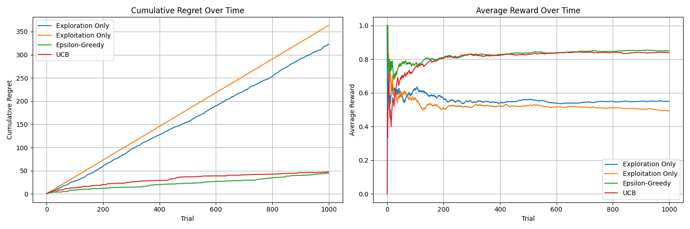

# Multi-Armed Bandit: Algorithm Comparison

This project compares multiple strategies for solving the multi-armed bandit problem, focusing on the trade-off between exploration and exploitation.

## Implemented Strategies

- Exploration Only
- Exploitation Only
- Epsilon-Greedy (ε = 0.1)
- Upper Confidence Bound (UCB)

## MAB Comparison Plot

## Summary of Results
The experiments were run for 1000 trials. The plot shows:

- **Cumulative Regret**: UCB and Epsilon-Greedy consistently maintain lower regret than the others.
- **Average Reward**: Both UCB and Epsilon-Greedy converge quickly to high reward levels.

## Key Insights

- UCB adapts exploration based on uncertainty, making it robust and effective without parameter tuning.
- Epsilon-Greedy performs reliably if ε is chosen well, but may require tuning for different environments.
- Pure exploitation can lock into suboptimal arms early and perform poorly.
- Pure exploration never improves its decisions, leading to high long-term regret.
- Smart exploration strategies are essential for learning in uncertain environments.