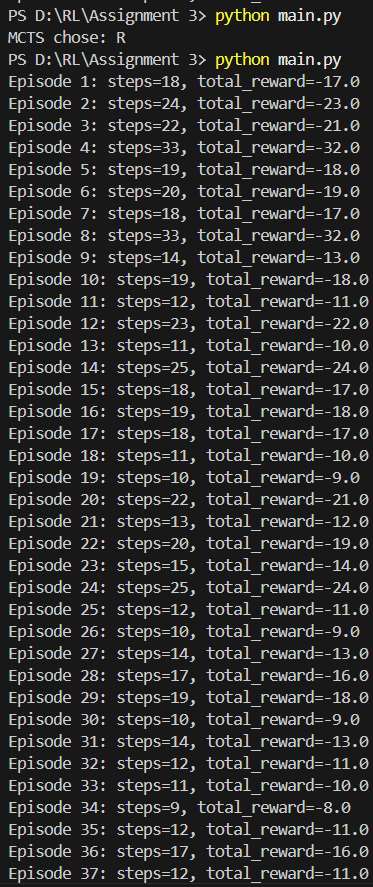

# Assignment 3: RTDP (Decaying Epsilon) & MCTS (UCT) on GridWorld

## Overview
This assignment explores two planning algorithms for Markov Decision Processes (MDPs) in a GridWorld environment:
- **RTDP (Real-Time Dynamic Programming)** with a decaying epsilon-greedy policy.
- **MCTS (Monte Carlo Tree Search)** using the UCT (Upper Confidence bounds applied to Trees) formula.

## Implementation Details
- **RTDP**:
	- Performs Bellman backups: `V[s] = max_a E[r + gamma * V[s']]`.
	- Uses epsilon-greedy action selection over one-step lookahead Q-values, with epsilon decaying over episodes.
- **MCTS**:
	- Each iteration includes selection, expansion, rollout, and backpropagation.
	- UCT formula: `Q + c * sqrt(ln N / (1 + N_a))`.
	- Returns the most visited action from the root after all rollouts.

## Results

- Both algorithms are run on the default 5x6 GridWorld with obstacles and stochastic transitions.
- For each episode/search, the number of steps to reach the goal and the total reward are printed.

## RTDP vs MCTS: Brief Comparison
- **RTDP** incrementally improves value estimates for visited states, leading to more efficient paths as learning progresses. Early episodes may show high variability in steps and rewards due to exploration, but performance stabilizes as epsilon decays.
- **MCTS** plans from scratch for each search, using simulated rollouts to evaluate actions. It is effective for single-shot planning but does not accumulate knowledge across episodes.
- On this map, RTDP typically converges to a near-optimal policy after several episodes, while MCTS can find good actions in each search but may require more computation per decision.
- RTDP benefits from value reuse, while MCTS is more flexible for large or unknown environments.

## Quick Insight
Episodes typically finish within 9–33 steps, with negative total rewards—indicating ongoing exploration and learning. The single MCTS decision observed was “R”, while RTDP episode rewards varied widely. More episodes, a slower epsilon decay, or increased MCTS rollouts can improve stability and performance.

